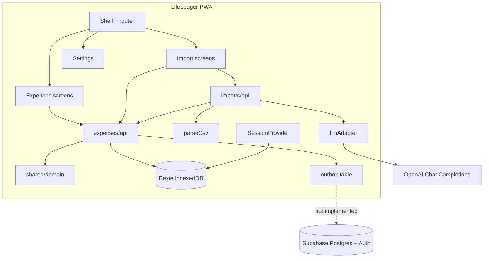

# 01 — Architecture

See `DECISIONS.md` for the full ADR log. This file describes the running system.

## Architecture style

**Local-first modular monolith.** One deployable (static SPA). Module boundaries follow **data ownership** (expenses vs imports vs future journal), not “frontend vs backend.”

Cloud, when enabled, is **sync + SQL reports + Auth**, not the only place business rules live. Rules exist in TypeScript (Dexie) and must be mirrored in Postgres CHECK + RLS.

## Component diagram

## Module relationships

| Module | May depend on | Must not depend on |
|--------|----------------|--------------------|
| `shared/domain` | nothing app-specific | React, Dexie, OpenAI |
| `shared/lib` | domain constants | features, LLM |
| `shared/db` | domain types | features |
| `shared/auth` | db, supabase flag | imports/llm |
| `features/expenses` | shared, `MonthSummary` type | `imports/parseCsv`, `imports/llm` |
| `features/imports` | shared, `expenses/api.proposeImported` | writing expenses tables except via expenses API |
| `app` | features screens | parsers |

`buildMonthSummary` lives in expenses because it aggregates **committed** expenses. Import’s `reviewMonthWithLlm` consumes that DTO.

## Data flow — manual expense

1. Form validates amount via `parseAmountToMinor` (throws on empty/NaN).
2. `addManualExpense` assigns UUID, `origin: manual`, fingerprint from note, timestamps, `deletedAt: null`.
3. Insert `expenses` + `outbox` kind `expense.upsert`.
4. Page reloads lists from Dexie.

## Data flow — statement import

1. User picks file and target **active ledger**.
2. Read `file.text()` in the browser.
3. `parseCsvStatement` → `ExpenseDraft[]` (`origin: statement`).
4. If empty and `useLlmFallback`, `llmAdapter.extractTransactions` → Zod `parseDrafts`.
5. Insert `import_batches`, then `proposeImported` (skip duplicate fingerprints).
6. User accepts on expenses page → new `expenses` row + proposal `accepted` + outbox.

## Data flow — month review

1. User clicks review (explicit).
2. `buildMonthSummary` from Dexie for current `YYYY-MM`.
3. POST to OpenAI with system prompt + `DATA FOLLOWS` + JSON.
4. Render `MonthReviewResult` in memory only (not persisted in Dexie in current code).

## Request lifecycle (LLM)

- No backend proxy.
- Browser `fetch` to `https://api.openai.com/v1/chat/completions`.
- Authorization: `Bearer` user key.
- Failure: throw; UI shows message; ledger unchanged.
- Retry: user clicks again. Extract+confirm is idempotent via fingerprints; review is read-only.

## Request lifecycle (Supabase) — planned

Not implemented. Intended:

1. Magic link → JWT in client session.
2. Pull ledgers/memberships/expenses for the user into Dexie.
3. Drain outbox with upsert by UUID; handle 401 by refresh; do not retry 401 in a loop.
4. Pull on window focus / online.

## Scaling notes

First bottlenecks: sync correctness and IndexedDB size, not HTTP. Index expenses by `ledgerId + spentOn`. Cap imports (intent: ~20k rows) in the wizard later. Unique `(ledger_id, fingerprint)` where live.

## SPOFs

- Device IndexedDB before first successful sync (browser wipe loses unsynced outbox).
- OpenAI availability for review/extract only.
- Future: Supabase project + owner email for magic links.
