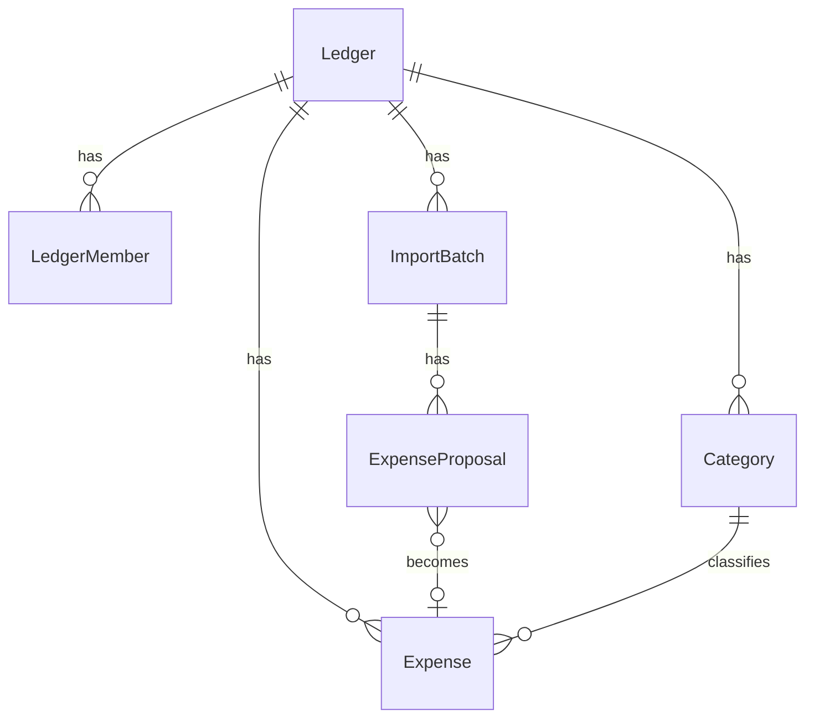

# 08 — Data models

CamelCase in TypeScript / Dexie. snake_case in Postgres. Same meaning.

## Enums

- `LedgerKind`: `personal` | `shared`
- `MemberRole`: `owner` | `editor` | `viewer`
- Member `status`: `active` | `invited`
- Category `kind`: `need` | `want` | `unspecified`
- `PaymentMethod`: `upi` | `card` | `cash` | `other`
- `ExpenseOrigin`: `manual` | `statement`
- `ProposalStatus`: `pending` | `accepted` | `rejected`
- Import `extractor`: `csv` | `ofx` | `pdf-text` | `llm`
- Import batch `status`: `parsed` | `reviewed` | `committed`

## Ledger

- `id` UUID
- `name` string
- `kind`
- `currency` (default INR)
- `createdBy` user id
- `createdAt`, `updatedAt` ISO timestamps

**Rule:** at most one `personal` ledger per `createdBy` in Postgres.

## LedgerMember

- Composite identity `ledgerId + userId`
- `role`, `status`

## Category

- `id`, `ledgerId`, `name`, `kind`, `archivedAt` null or ISO

**Seed names:** Food, Transport, Rent, Utilities, Health, Transfer, Other with kinds need/need/need/need/need/unspecified/unspecified.

## ExpenseDraft (shared contract)

Required: `id`, `ledgerId`, `amountMinor` (int > 0), `currency` (3 chars in Zod), `spentOn` (`YYYY-MM-DD`), `categoryId` (nullable), `note`, `paymentMethod`, `origin`.

Optional: `importBatchId`, `fingerprint`, `rawDescription`, `bankTxnId`.

## Expense

Draft plus `createdBy`, `updatedBy`, `createdAt`, `updatedAt`, `deletedAt` (null if live).

## ExpenseProposal

Draft plus required `importBatchId`, `fingerprint`, `status`, `createdBy`.

**Note:** Accepting creates a **new** expense `id`; proposal `id` remains on the proposal row.

## ImportBatchRow (Dexie)

`id`, `ledgerId`, `filename`, `extractor`, `status`, `reviewText` (nullable, unused), `createdBy`, `createdAt`.

Postgres `import_batches` uses `review_json` jsonb instead of `reviewText`.

## SessionRow

Singleton `id: "current"`, `userId`, `email`, `activeLedgerId`.

## OutboxRow

`id`, `kind` (currently `expense.upsert`), `payload` unknown (full expense), `createdAt`.

## MonthSummary (LLM input)

`ledgerName`, `month` (`YYYY-MM`), `currency`, `totals: { manual, statement, all }` (minor units), `byCategory[]` (`categoryId`, `categoryName`, `totalMinor`, `count`), `outliers[]` (`spentOn`, `amountMinor`, `note`).

## MonthReviewResult (LLM output)

`summary` string, `bullets` string[], `anomalies` string[].

## Relationships

Users (Auth or demo id) relate through members and `createdBy`/`updatedBy`, not as expense tenants.

## Fingerprint algorithm

1. Uppercase description
2. Collapse whitespace
3. Strip characters not in `A-Z0-9 @._-`
4. UTF-8 SHA-256 hex of `ledgerId|spentOn|amountMinor|desc|bankTxnId`

Postgres unique: `(ledger_id, fingerprint)` where fingerprint not null and `deleted_at` is null (expenses); all proposals `(ledger_id, fingerprint)`.

## Money

`MINOR_PER_MAJOR = 100`. `rupeesToMinor` rounds via `Math.round(n * 100)`. Display `formatInr` with `en-IN` grouping.

## Demo constants

- User id: `local-demo-user`
- Email: `you@local`
- Ledger name: `Personal`
